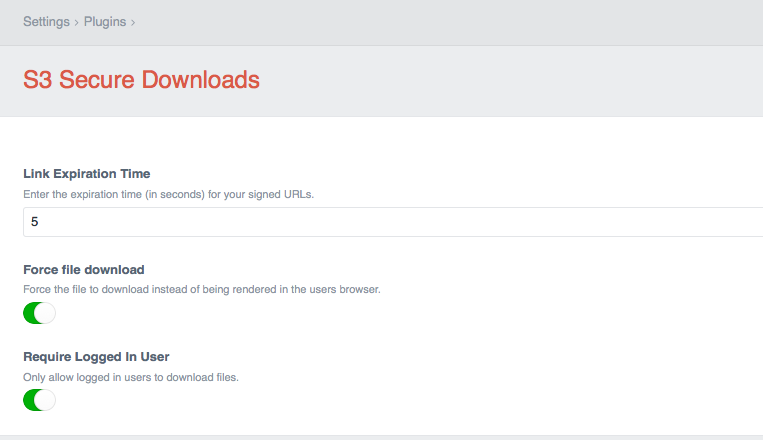

# S3 Secure Downloads plugin for Craft CMS

This plugin will return a [pre-signed URL](http://docs.aws.amazon.com/AmazonS3/latest/dev/ShareObjectPreSignedURL.html) used to allow temporary access to private objects with an expiring URL. You can optionally allow file downloads only for logged in users and force file downloads (useful for PDF files).

From the original developer, [Jonathan Melville](https://github.com/jonathanmelville/s3securedownloads):

> This plugin was originally developed for a client in the financial services industry who wanted to make sure only logged in users had access to downloads of financial reports, and download links couldn’t be shared. … Now you can keep your S3 objects private but grant temporary access to them with an expiring link. 



## AWS Signature Version

[As of June 24, 2020](https://aws.amazon.com/blogs/aws/amazon-s3-update-sigv2-deprecation-period-extended-modified/), all new AWS S3 buckets require Signature Version 4. Previously, this was only required for certain regions.

Upgrading the S3 plugin to the latest version (v3.x) will solve this issue and use Signature Version 4 by default.

## Installation

```sh
# Require the plugin with composer
composer require kennethormandy/craft-s3securedownloads

# Install the plugin via the Control Panel, or by running:
./craft install/plugin s3securedownloads
```

## Usage

Pass in an asset's entry id and it will return a pre-signed URL for that asset:

```twig

<a href="{{ getSignedUrl(asset.id) }}">{{ asset }}</a>
```

By default, only users logged in will be able to generate the pre-signed URL. This can be changed within the plugin settings.

The generated a pre-signed AWS S3 URL will expire after 24 hours, or however long you have configured in the plugin settings.

<!--

## AWS S3 configuration

- Make sure you have configured the Craft AWS S3 plugin and setup an [AWS IAM permissions](https://github.com/craftcms/aws-s3#aws-iam-permissions)
- Works with or without “Objects can be public” for S3 bucket public access permissions
- Set “Assets in this volume have public URLs” to `true`, and give the bucket URL (although from more recent testing, you can set the bucket URL and then disable it, and the asset.url won’t be given? Maybe this is preferable in terms of config?)
- Set “Make Uploads Public” to `false`

- Optionally, configure the bucket to block certain signature versions https://docs.aws.amazon.com/AmazonS3/latest/API/bucket-policy-s3-sigv4-conditions.html

-->

## Events

- `kennethormandy\s3securedownloads\services\SignUrl`
  - `SignUrl::EVENT_BEFORE_SIGN_URL`
  - `SignUrl::EVENT_AFTER_SIGN_URL`

```php
use Craft;
use yii\base\Event;
use kennethormandy\s3securedownloads\events\SignUrlEvent;
use kennethormandy\s3securedownloads\services\SignUrl;

// …

Event::on(
    SignUrl::class,
    SignUrl::EVENT_BEFORE_SIGN_URL,
    function (SignUrlEvent $event) {
        $asset = $event->asset;
        Craft::info("Handle EVENT_BEFORE_SIGN_URL event here", __METHOD__);
    }
);

Event::on(
    SignUrl::class,
    SignUrl::EVENT_AFTER_SIGN_URL,
    function (SignUrlEvent $event) {
        $asset = $event->asset;
        Craft::info("Handle EVENT_AFTER_SIGN_URL event here", __METHOD__);
    }
);
```

## Original version

S3 Secure Downloads is built for Craft v3.x. For a version that runs on Craft v2.5.x, see [the original plugin](https://github.com/jonathanmelville/s3securedownloads). [Note that as of June 24, 2020](https://aws.amazon.com/blogs/aws/amazon-s3-update-sigv2-deprecation-period-extended-modified/) all new AWS S3 buckets require URLs to be signed using Signature Version 4, and the original plugin (understandably) only signs URLs using Signature Version 2.

## License

[The MIT License (MIT)](./LICENSE.md)

Copyright © 2016–2019 [Jonathan Melville](https://github.com/jonathanmelville/s3securedownloads)<br/>
Copyright © 2019–2020 [Kenneth Ormandy Inc.](https://kennethormandy.com)
